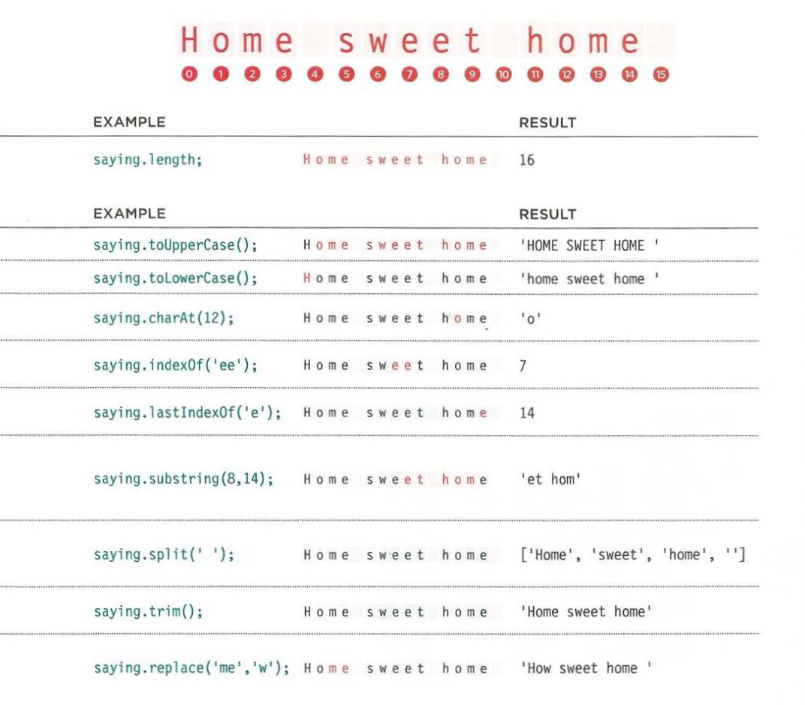

# Data types

In JavaScript there are six data types:

- Five of them are described as `primitive` data types.
- The sixth is the object (and is referred to as a complex data type).

| Key       | Value type                |
| --------- | ------------------------- |
| String    | "JavaScript is awesome!!" |
| Number    | 1,2,2.5,...               |
| Boolean   | true, false               |
| Undefined | Undefined                 |
| Null      | null                      |
| Object    | {}                        |

Whenever you have a value that is a string, you can use the properties and methods of the String object on that valu e. This example stores the phrase "Home sweet home " in a variable.

```js
let saying = "Home sweet home ";
```

When you declare a variable in JavaScript, It will be wrapped under the hood with objects according to the type of the variable. In our example we define a string and for that javaScript wrap the variable with special methods that we can use. The properties & methods are:

**Properties**

| Property | Description                                                                     |
| -------- | ------------------------------------------------------------------------------- |
| `length` | Returns number of characters in the string in most cases (see note bottom-left) |

<br />

**Methods**

| Property        | Description                                                                                                                                                               |
| --------------- | ------------------------------------------------------------------------------------------------------------------------------------------------------------------------- |
| `toUpperCase()` | Changes string to uppercase characters                                                                                                                                    |
| `toLowerCase()` | Changes string to lowercase characters                                                                                                                                    |
| `charAt()`      | Takes an index number as a parameter, and returns the character found at that position                                                                                    |
| `indexOf()`     | Returns index number of the first time a character or set of characters is found within the string                                                                        |
| `lastIndexOf()` | Returns index number of the last time a character or set of characters is found within the string                                                                         |
| `substring()`   | Returns characters found between two index numbers where the character for the first index number is included and the character for the last index number is not included |
| `split()`       | When a character is specified, it splits the string each time it is found, then stores each individual part in an array                                                   |
| `trim()`        | Removes whitespace from start and end of string                                                                                                                           |
| `replace()`     | Like find and replace, it takes one value that should be found, and another to replace it (by default, it only replaces the first match it finds)                         |

Each character in a string is automatically given a number, called an `index` number. Index numbers always start at **zero** and not one (just like for items in an array).

`

### References and Terms:

> :gem: Read more about [Data type structure in JavaScript](https://developer.mozilla.org/en-US/docs/Web/JavaScript/Data_structures)
